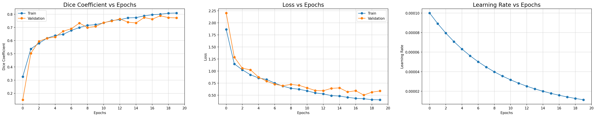

<p>
  <a href="https://colab.research.google.com/drive/1nnq5u0Jl0UAcGsXue8GJ2EmWqOShP_nJ#scrollTo=0wGIkUgZGrCL">
    
  </a>


# Real-Time Orthomosaic and Semantic Map Generation: Semantic Segmentation of Aerial Drone Images 


## Semantic Drone Dataset

<p align="justify">The <a href="http://dronedataset.icg.tugraz.at/">Semantic Drone Dataset</a> focuses on semantic understanding of urban scenes for increasing the safety of autonomous drone flight and landing procedures. The imagery depicts more than 20 houses from nadir (bird's eye) view acquired at an altitude of 5 to 30 meters above ground. A high resolution camera was used to acquire images at a size of 6000x4000px (24Mpx). The training set contains 400 publicly available images and the test set is made up of 200 private images.</p>

<p align="center">
  
</p>

## UAVid Dataset

<p align="justify">The <a href="https://www.uavid.com/">The UAVid dataset</a> is an UAV video dataset for semantic segmentation task focusing on urban scenes. It has several features:

Semantic segmentation
4K resolution UAV videos
8 object categories
Street scene context.

The segmentation categories need to be converted to the format of the Semantic Drone Dataset, as seen below</p>

<br>

### Semantic Annotation

The train images are labeled densely using polygons and contain the following 24 classes:

| Name        | R   | G   | B   | Color                                                                                        |
| ----------- | --- | --- | --- | -------------------------------------------------------------------------------------------- |
| unlabeled   | 0   | 0   | 0   | <p align="center"></p>   |
| paved-area  | 128 | 64  | 128 | <p align="center"></p>  |
| dirt        | 130 | 76  | 0   | <p align="center"></p>        |
| grass       | 0   | 102 | 0   | <p align="center"></p>       |
| gravel      | 112 | 103 | 87  | <p align="center"></p>      |
| water       | 28  | 42  | 168 | <p align="center"></p>       |
| rocks       | 48  | 41  | 30  | <p align="center"></p>       |
| pool        | 0   | 50  | 89  | <p align="center"></p>        |
| vegetation  | 107 | 142 | 35  | <p align="center"></p>  |
| roof        | 70  | 70  | 70  | <p align="center"></p>        |
| wall        | 102 | 102 | 156 | <p align="center"></p>        |
| window      | 254 | 228 | 12  | <p align="center"></p>      |
| door        | 254 | 148 | 12  | <p align="center"></p>        |
| fence       | 190 | 153 | 153 | <p align="center"></p>       |
| fence-pole  | 153 | 153 | 153 | <p align="center"></p>  |
| person      | 255 | 22  | 0   | <p align="center"></p>      |
| dog         | 102 | 51  | 0   | <p align="center"></p>         |
| car         | 9   | 143 | 150 | <p align="center"></p>         |
| bicycle     | 119 | 11  | 32  | <p align="center"></p>     |
| tree        | 51  | 51  | 0   | <p align="center"></p>        |
| bald-tree   | 190 | 250 | 190 | <p align="center"></p>   |
| ar-marker   | 112 | 150 | 146 | <p align="center"></p>   |
| obstacle    | 2   | 135 | 115 | <p align="center"></p>    |
| conflicting | 255 | 0   | 0   | <p align="center"></p> |

### Sample Images

<p align="center"></p>


## Approach

### Folder Structure
```
├───augmented_images
├───label_colors
├───predictions
│   └───compressed
├───sample_images
├───semantic_drone_dataset
│   ├───code
│   ├───training_set
│   │   ├───gt
│   │   │   ├───bounding_box
│   │   │   │   ├───bounding_boxes
│   │   │   │   │   └───person
│   │   │   │   ├───label_me_xml
│   │   │   │   ├───masks
│   │   │   │   │   └───person
│   │   │   │   └───masks_instances
│   │   │   │       └───person
│   │   │   └───semantic
│   │   │       ├───label_images
│   │   │       └───label_me_xml
│   │   └───images
│   ├───aug_masks
│   ├───train
│   └───processed_dataset
│       ├───train_masks
│       │   └───train
│       └───train_images
│           └───train
├───augmented-semantic-drone-dataset
│   ├───val_masks
│   │   └───val
│   ├───val_images
│   │   └───val
│   ├───train_masks
│   │   └───train
│   ├───train_images
│   │   └───train
│   └───demo_img
│       └───demo
├───pretrained_weights
```

### Data Augmentation using Albumentations Library

<p align="justify"><a href="https://albumentations.ai/">Albumentations</a> is a Python library for fast and flexible image augmentations. Albumentations efficiently implements a rich variety of image transform operations that are optimized for performance, and does so while providing a concise, yet powerful image augmentation interface for different computer vision tasks, including object classification, segmentation, and detection.</p>

<p align="justify">There are only 400 images in the semantic drone dataset, out of which 80% are used for training and the remaining 20% for validation set. Data augmentation increases the training data upto 5 times. So, the total number of images in the training set is 1600, and 80 images in the validation set, after data augmentation.</p>

Data augmentation is achieved through the following techniques:

- Random Cropping
- Horizontal Flipping
- Vertical Flipping
- Rotation
- Random Brightness & Contrast
- Contrast Limited Adaptive Histogram Equalization (CLAHE)
- Grid Distortion
- Optical Distortion

Here are some sample augmented images and masks of the dataset:

<p align="center"></p>
<p align="center"></p>

to" height= "auto" src="./augmented_images/aug_mask_092.png" /></p>

### VGG-16 Encoder based UNet Model

<p align="justify">The <a href="https://arxiv.org/abs/1505.04597">UNet</a> architecture contains two paths. First is the contraction path (also called as the encoder). The encoder is just a traditional stack of convolutional and max pooling layers. The second path is the symmetric expanding path (also called as the decoder) which is used to enable precise localization using transposed convolutions. Thus, it is an end-to-end fully convolutional network (FCN), i.e. it only contains Convolutional layers and does not contain any Dense layer because of which it can accept image of any size.</p>

<p align="center">

</p>

<p align="center"><i>U-Net architecture (example for 32x32 pixels in the lowest resolution). Each blue box corresponds to a multi-channel feature map. The number of channels is denoted on top of the box. The x-y-size is provided at the lower left edge of the box. White boxes represent copied feature maps. The arrows denote the different operations.</i></p>

#### Custom VGG16-UNet Architecture

- A VGG16 model pre-trained on the ImageNet dataset has been used as an Encoder network, i.e. we load the weights into this portion.

- A Decoder network has been extended from the last layer of the pre-trained model, and it is concatenated to the consecutive convolution blocks.

<p align="center">

</p>
<p align="center"><i>VGG16 Encoder based UNet CNN Architecture</i></p>

A detailed layout of the model is available [here](./vgg16_unet_plot.png).

### Hyper-Parameters

1. Batch Size = 2
2. Steps per Epoch = 200.0
3. Validation Steps = 10.0
4. Input Shape = (256, 256, 3)
5. Initial Learning Rate = 0.0001 (with Exponential Decay LearningRateScheduler callback)
6. Number of Epochs = 20 (with ModelCheckpoint & EarlyStopping callback)

## Results

### Training Results

|   Model    |                   Epochs                   | Train Dice Coefficient | Train Loss | Val Dice Coefficient | Val Loss |    Max. (Initial) LR    |         Min. LR         | Total Training Time |
| :--------: | :----------------------------------------: | :--------------------: | :--------: | :------------------: | :------: | :---------------------: | :---------------------: | :-----------------: |
| VGG16-UNet | 20 (best weights at 18<sup>th</sup> epoch) |         0.8781         |   0.2599   |        0.8702        | 0.29959  | 1.000 × 10<sup>-4</sup> | 1.122 × 10<sup>-5</sup> | 23569 s (06:32:49)  |

<p align="center"></p>

The <a>`model_training_csv.log`</a> file contain epoch wise training details of the model.

### Visual Results

Predictions on Validation Set Images:

<p align="center"></p>
<p align="center"></p>

## References


1. Karen Simonyan and Andrew Zisserman, "**Very Deep Convolutional Networks for Large-Scale Image Recognition**", arXiv:1409.1556, 2014. [\[PDF\]](https://arxiv.org/pdf/1409.1556v6.pdf)
2. Olaf Ronneberger, Philipp Fischer and Thomas Brox, "**U-Net: Convolutional Networks for Biomedical Image Segmentation**", arXiv:1505. 04597, 2015. [\[PDF\]](https://arxiv.org/pdf/1505.04597.pdf)
3. Towards Data Science- [Understanding Semantic Segmentation with UNET](https://towardsdatascience.com/understanding-semantic-segmentation-with-unet-6be4f42d4b47), by Harshall Lamba
4. Keract by Philippe Rémy [\(@github/philipperemy\)](https://github.com/philipperemy/keract) used under the IT License Copyright (c) 2019.

